# WorkTalk AI · 職場溝通與談判教練

> 把職場的「眉角」，練成本能。

[](https://worktalk-ai.pages.dev)
[](https://vitejs.dev)
[](https://react.dev)
[](https://pages.cloudflare.com)

WorkTalk AI 是一個專為**校園過渡到職場**的新鮮人設計的溝通與談判教練平台。透過真實情境的 AI 對話演練、即時溝通診斷、與表達優化建議，把「向主管提案、拒絕加班、跨部門協作、談加薪」這些難開口的時刻，提前在安全的環境練到滿意為止。

🌐 **線上 Demo**：<https://worktalk-ai.pages.dev>

---

## 🖼️ 介面預覽

<table>
  <tr>
    <td width="50%"><a href="docs/screenshots/01-login.png">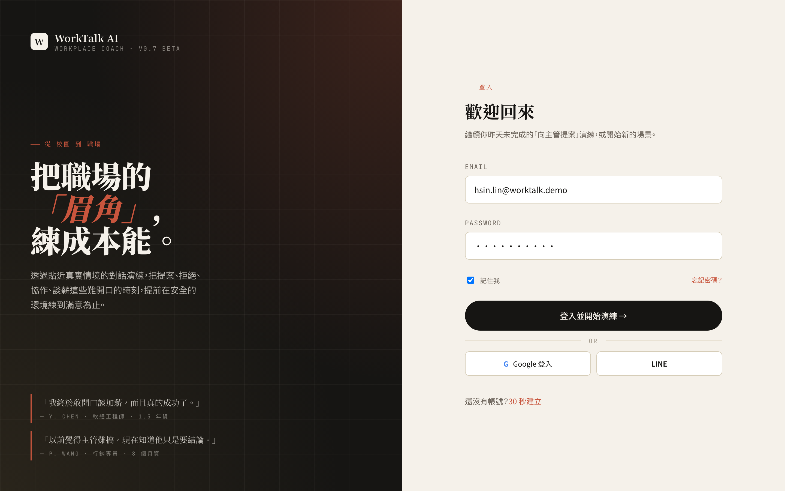</a><p align="center"><em>登入頁 · 編輯式雙欄佈局</em></p></td>
    <td width="50%"><a href="docs/screenshots/05-home.png">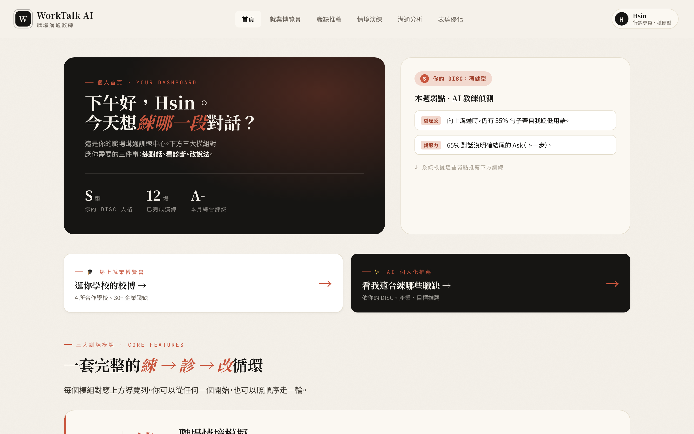</a><p align="center"><em>首頁 · 個人化 Dashboard 與訓練樞紐</em></p></td>
  </tr>
  <tr>
    <td><a href="docs/screenshots/07-chat.png">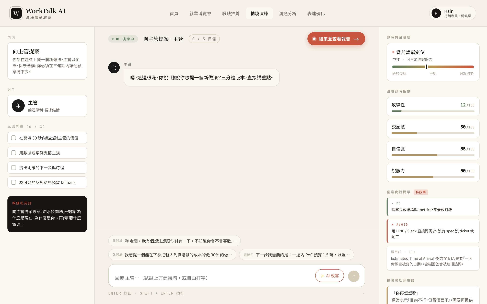</a><p align="center"><em>情境演練 · 三欄式聊天介面</em></p></td>
    <td><a href="docs/screenshots/08-report.png">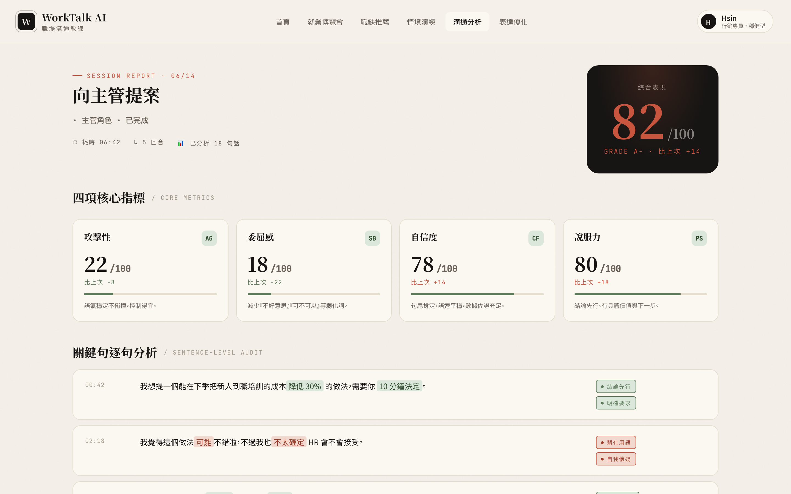</a><p align="center"><em>溝通分析報告 · 四項指標與逐句標註</em></p></td>
  </tr>
  <tr>
    <td><a href="docs/screenshots/10-careerfair-list.png">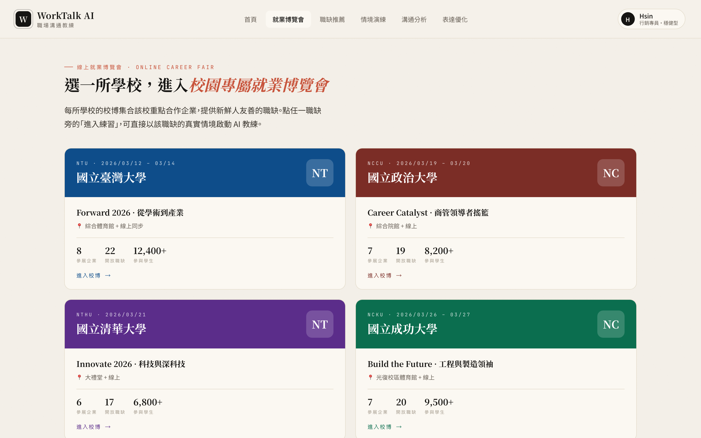</a><p align="center"><em>線上就業博覽會 · 4 所合作學校</em></p></td>
    <td><a href="docs/screenshots/12-recommendations.png">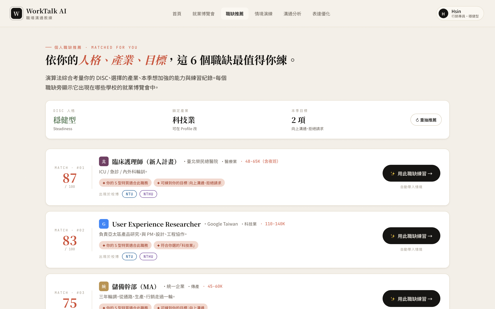</a><p align="center"><em>個人職缺推薦 · AI 加權打分</em></p></td>
  </tr>
</table>

<details>
<summary>看完整 12 張截圖（onboarding 三步 + 全部功能畫面）</summary>

| | | |
|---|---|---|
|  | 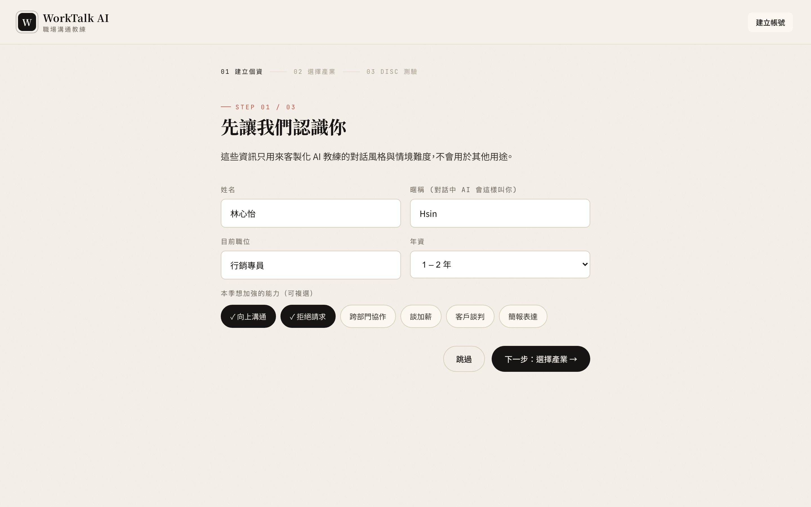 | 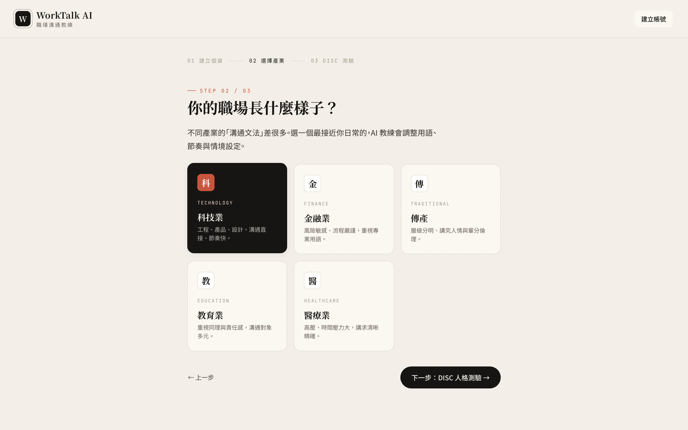 |
| 01 Login | 02 Profile | 03 Industry |
| 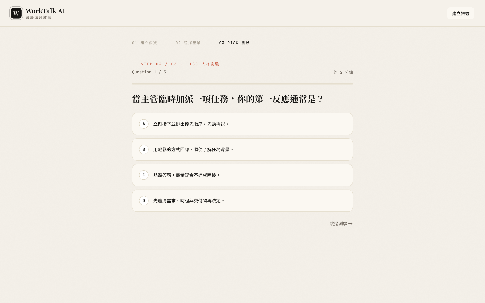 |  | 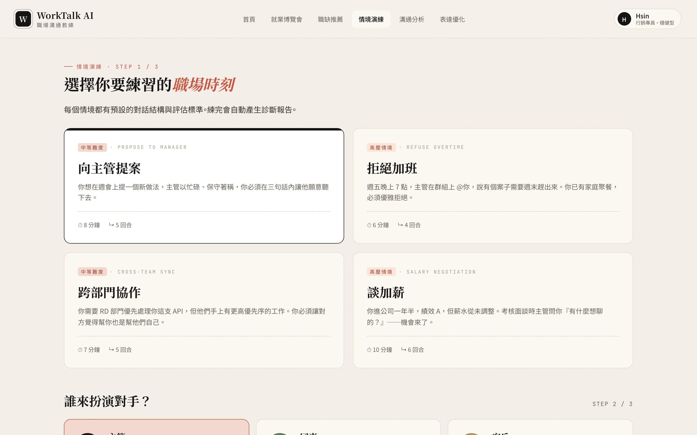 |
| 04 DISC | 05 Home | 06 Scenario Picker |
|  |  | 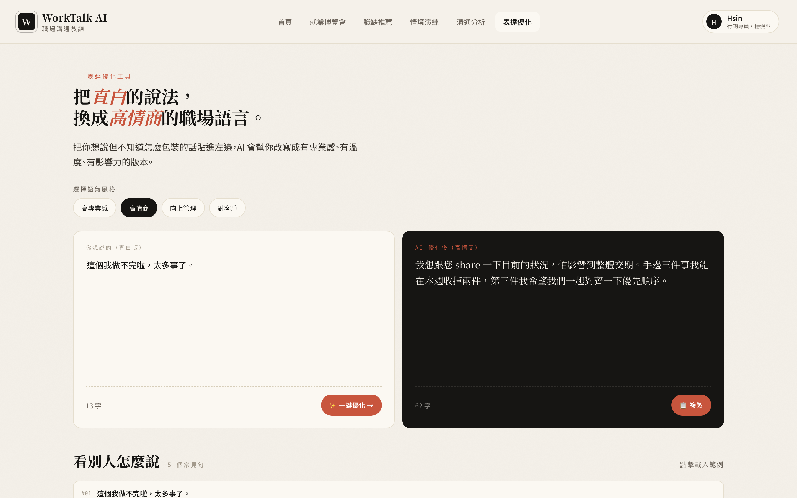 |
| 07 Chat | 08 Report | 09 Optimize |
|  | 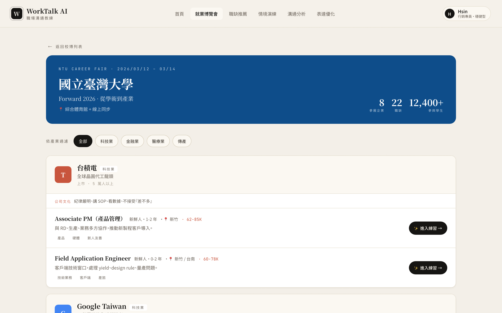 |  |
| 10 Career Fair | 11 School Fair | 12 Recommendations |

</details>

---

## 🎯 為什麼做這個

大專院校畢業生最焦慮的，往往不是專業技能，而是「進職場後怎麼開口」：
- 怎麼跟主管提案、不被當成菜鳥打發？
- 怎麼優雅拒絕加班、又不破壞關係？
- 怎麼跟其他部門協作、讓對方願意配合？
- 怎麼談加薪、不會把場面搞僵？

這些「軟技能」沒有教科書、沒有標準答案、也沒人會跟你練。WorkTalk AI 把這個訓練過程**遊戲化、可重複、可診斷**。

---

## ✨ 核心功能

### 練 → 診 → 改：完整訓練閉環

| 模組 | 功能 | 說明 |
|---|---|---|
| 🎯 **練** · 情境演練 | 4 大情境 × 3 種對手 × 文字/語音模式 | 與 AI 角色（主管/同事/客戶）真實對話，挑戰你不擅長的場景 |
| 📊 **診** · 溝通分析 | 4 項即時指標 + 逐句標註 + AI 改寫 | 每場演練後自動產生報告，標出弱化詞、自信度、說服力等問題 |
| ✏️ **改** · 表達優化 | 4 種語氣風格 + 產業 Know-How | 把「我做不完啦」這種直白話一鍵升級成高情商表達 |

### 校園就業生態系

| 模組 | 功能 | 說明 |
|---|---|---|
| 🎓 **線上就業博覽會** | 4 所合作學校 × 12 間企業 × 30+ 職缺 | 點任一職缺旁的「進入練習」即自動帶入該職缺的情境、對手職位、個性、語氣 |
| 🤖 **AI 職缺推薦** | DISC × 產業 × 目標加權打分 | 推薦最適合你練習的 6 個職缺，並顯示它們出現在哪些校博 |

### 個人化貫穿全站

使用者在 onboarding 時完成的 **DISC 人格測驗 + 產業選擇 + 本季目標**，會持續影響：
- 首頁的弱點偵測與推薦情境
- 聊天室右側的產業實戰提示
- 表達優化頁的產業 Know-How
- 職缺推薦的加權排序
- 對手客製化（自訂 AI 對手的名字、職位、個性、語氣）

---

## 🎨 設計亮點

- **編輯式視覺**：避開科技藍 + 機器人擬人的傳統 AI 工具語言，改用襯線字體 + 暖米底色 + 編輯式排版，傳達「這是專業教練，不是聊天機器人」
- **三層字體系統**：Noto Serif TC（標題/品牌）、Noto Sans TC（UI/內文）、JetBrains Mono（數據/標籤）
- **克制配色**：暖米底 + 墨黑主色 + 赤陶紅強調色（全站使用面積 < 5%），加上鼠尾草綠 / 金黃 / 暗紫三個情境輔色
- **資訊密度服膺情境**：練習區降低干擾、聚焦對話；分析報告允許高密度資訊呈現

---

## 🛠️ 技術棧

| 類別 | 選擇 | 理由 |
|---|---|---|
| 建構工具 | **Vite 8** | 快速 HMR、預編譯產出純靜態檔 |
| 框架 | **React 19** | 元件化、生態系完整 |
| 樣式 | **Pure CSS + Design Tokens** | 不依賴 UI library、設計稿可 100% 重現 |
| 部署 | **Cloudflare Pages** | 全球邊緣節點、無冷啟動、適合校園推廣場景 |
| 資料層 | **預先寫死的 ES Modules** | 純前端 Demo、無 backend、無 API key、無資料庫 |

**Bundle size**：~100 KB gzip（含 React 19 + 所有應用程式碼）

---

## 🚀 快速開始

### 本地開發

```bash
git clone https://github.com/juliechiang21/worktalk-ai.git
cd worktalk-ai
npm install
npm run dev          # 開啟 http://localhost:5173
```

**Demo 帳號**：直接點「登入」即可（所有資料寫死，可任意填）

**鍵盤快捷鍵**：`h` 跳首頁、`r` 跳分析報告（demo 用）

### 部署到 Cloudflare Pages

```bash
npm run deploy
```

第一次會要求 `wrangler login` 做 OAuth 授權；之後就會把 `dist/` 推上去。

也可以連結這個 GitHub repo 到 Cloudflare Dashboard，享受 push 自動部署。

---

## 📁 專案結構

```
src/
  data.js                  # 對話腳本、分析報告、優化範例、產業 Know-How
  data-careerfair.js       # 學校、企業、職缺、推薦演算法
  App.jsx                  # Router & 全域狀態
  main.jsx                 # 入口
  styles.css               # 設計 Tokens 與全站樣式（~2000 行）
  components/
    Shared.jsx             # 共用元件：TopBar、Stepper、MultiPick
  screens/
    Auth.jsx               # Login / Profile / Industry / DISC
    Main.jsx               # Home / 情境選擇器（含對手客製化）
    Chat.jsx               # 聊天室 / 語音模式 / AI 改寫 Modal
    Analysis.jsx           # 溝通分析報告 / 表達優化（含產業 Know-How）
    CareerFair.jsx         # 校博列表 / 校博內頁
    Recommendations.jsx    # 個人職缺推薦
```

---

## 🗺️ 全站動線

```
登入 ─► Profile ─► 產業選擇 ─► DISC 測驗 ─► 首頁
                                              │
        ┌─────────────────────────────────────┼─────────────────────────────────┐
        ▼                                     ▼                                 ▼
  線上就業博覽會                          練 → 診 → 改                       AI 職缺推薦
        │                                     │                                 │
    選學校                                情境演練 ─► 聊天/語音                個性分析
        ▼                                     │                                 ▼
   校博內頁 ─► 點職缺 ─► (帶入預設) ──────►   ▼                             推薦職缺
                                          溝通分析 ─► AI 改寫           (含校博資訊)
                                              │
                                              ▼
                                          表達優化 (含產業 Know-How)
```

---

## 🔮 未來方向（如商業化）

- 接入真實 LLM（OpenAI / Anthropic API），讓對話腳本不再寫死
- 真實大專院校合作（API 接學校就業輔導系統、企業 ATS）
- 訓練計畫與進度儀表板
- 多人對話演練（模擬會議情境）
- 語音識別與語調分析

---

## 📝 License

MIT — 本專案為學術 demo，歡迎參考與借鑑。

---

## 👤 Author

Designed & built with care by [@juliechiang21](https://github.com/juliechiang21)
Visual design via Claude · Implementation in collaboration with Claude Code.
